# Simulating a Cambridge Union Debate With Multi-Agent LLMs

[This breakdown was obviously written with LLM assistance. I pushed this after staying up the whole night to get the workflow done in time for the debate. A fully human blog post is in the works.]

**Can we predict how a real debate will unfold — before it happens?**

In February 2026, the Cambridge Union scheduled its Lent Term Fifth Debate on the motion *"This House Believes AI Should Be Allowed To Make Decisions About Human Life."* Six speakers (AI researchers, an MP, an international law professor, and two student debaters) would face off in the Union's traditional 3v3 exhibition format.

I had won a slot to participate in this sebate but wanted to see if I could simulate it first.

A full simulation: six distinct speakers, each arguing from their own published positions, responding to each other in real time, with points of information, definitions battles, and a verdict at the end. Then I wanted to run it dozens of times to map out the space of possible outcomes — what arguments dominate, where the clashes happen, and whether the result is robust or a coin flip.

This post documents the full methodology, the design choices that mattered, the things that broke, and — most interestingly — what I learned about using LLMs to judge arguments.

---

## The Inspiration: Project Debater and What's Changed

IBM's Project Debater (2019) was a landmark: a system that could construct argumentative speeches from a corpus and deliver them against human opponents. But it was built in a pre-LLM world. Its architecture relied on hand-crafted pipelines for argument mining, stance detection, and speech generation — impressive engineering, but brittle and narrow.

The theoretical case for AI debate goes back further. Irving, Christiano, and Amodei's *"AI Safety via Debate"* [[1]](#ref-irving2018) proposed a zero-sum game where two agents argue before a human judge, establishing a key result: judging debates is fundamentally easier than directly evaluating complex outputs. That paper explicitly discussed extending beyond two debaters, which makes it foundational for the team-based format I wanted to build.

Three things have changed since 2019 that make this newly feasible:

1. **Large language models can generate coherent, persona-faithful long-form text.** A well-prompted GPT-4 or o3 can sustain a 1,400-word speech in a specific person's voice, drawing on their documented positions, without collapsing into generic AI-speak. The modern multi-agent debate era kicked off in 2023 with Du et al. [[2]](#ref-du2024) demonstrating that 3 LLM instances debating over 2 rounds significantly improve factuality — including cases where all agents were initially wrong but converged on correct answers through adversarial exchange.

2. **Retrieval-Augmented Generation (RAG) grounds the simulation in real evidence.** Instead of memorising a speaker's corpus, the system retrieves relevant passages at inference time — meaning the same speaker can emphasise different evidence across runs.

3. **Multi-agent orchestration is now tractable.** Liang et al.'s MAD framework [[3]](#ref-liang2024) introduced explicit judge agents and adaptive termination. Chan et al.'s ChatEval [[4]](#ref-chan2024) showed that multi-agent referee teams with diverse personas outperform single judges by 6.2%. Tools like LangGraph provide the graph-based orchestration with cycles, conditional branching, and explicit state management these architectures require.

The strongest empirical validation came from Khan et al. [[5]](#ref-khan2024) (ICML 2024 Best Paper), which showed that debate with expert debaters achieved 76% accuracy with LLM judges and 88% with human judges, versus 48%/60% naïve baselines. The critical insight: **optimising debaters for persuasiveness improves truth-finding** — unlike consultancy, where stronger single advisors actually decrease accuracy. This asymmetry is the fundamental argument for building an adversarial pipeline rather than a cooperative one.

The question isn't whether the technology exists, but whether we could make something genuinely kind of useful to debaters: a simulation with enough fidelity and variation to tell you something you didn't already know about how the debate would go. I teamed up with my roommate from the army Bharath Anantham, who is currently the number one ranked debater in the world to build this out.

---

## Architecture Overview

The system runs in four phases, orchestrated by a LangGraph state machine:


Each phase deserves explanation, but the interesting design decisions cluster around three areas: making speakers sound like themselves, making the debate feel dynamic, and — the hardest problem — judging who won.

---

## Phase 0: Building a Speaker from Their Corpus

Each speaker has a data directory containing their published work:

```
data/speakers/
├── Henry Shevlin/
│   ├── bio/bio.md
│   ├── interviews/          # podcast transcripts, media appearances
│   ├── writings/            # academic papers (PDF), op-eds
│   └── speeches/
├── Fazl Barez/
│   ├── bio/bio.md
│   └── writings/            # 6 AI safety research papers (PDF)
├── Allison Gardner/
│   ├── bio/bio.md
│   ├── interviews/          # 3 transcribed interviews on AI bias
│   └── writings/            # conference presentation (PDF)
├── Demetrius Floudas/
│   ├── bio/bio.md
│   └── writings/            # international law papers (PDF)
└── Student Speaker/
    └── speeches/            # argument plans, philosophical notes
```

Documents are chunked (1,000 chars, 200 overlap), embedded with `text-embedding-3-large`, and stored in per-speaker ChromaDB collections. PDF extraction uses `pypdf` — nothing fancy, but reliable.

The more interesting step is **style extraction**. This follows the approach pioneered by the RoleLLM framework [[6]](#ref-rolellm2023), which formalised persona construction as a three-stage pipeline: role profile construction → context-based speaking style extraction → role-specific behaviour injection. A `gpt-4o` call analyses a sample of each speaker's writing and extracts a structured `StyleProfile`:

- **Speech register** (formal academic / conversational / polemical)
- **Opening patterns** (anecdotes? data? provocations?)
- **Rhetorical devices** (tricolons, analogies, understatement)
- **Disagreement style** (aggressive rebuttal? diplomatic concession-then-counter?)
- **Signature phrases** and verbal tics
- **Closing patterns**

This profile is injected into every prompt the speaker receives. The result is that Dr Henry Shevlin — a philosopher who favours careful analogies and Socratic questioning — sounds meaningfully different from Demetrius Floudas, an international law professor who argues from treaty precedent and structural analysis.

The persona grounding approach sits in a well-established hierarchy. At the lightweight end, Argyle et al.'s "silicon sampling" [[7]](#ref-argyle2023) showed that LLMs conditioned on demographic backstories can replicate aggregate-level survey response distributions — but only at the group level, not the individual level. At the heavyweight end, Character-LLM [[8]](#ref-shao2023) and CoSER [[9]](#ref-coser2025) demonstrated fine-tuning on individual corpora for fictional and historical characters. For real, living public figures in an adversarial debate, the middle ground — **RAG grounding with style profile injection** — offers the best trade-off between fidelity and dynamic reasoning.

### Design Choice: Why Not Fine-Tune?

Fine-tuning a model per speaker would produce more faithful voice mimicry. But it would also destroy the model's ability to reason dynamically about novel arguments from opponents. The RAG + style-injection approach preserves the base model's reasoning while constraining its *voice*. It's a trade-off, and for debate simulation — where responsiveness matters more than perfect mimicry — it's the right one. Santurkar et al.'s OpinionQA work [[10]](#ref-santurkar2023) reinforces this caution: RLHF-tuned models already skew toward liberal/higher-educated viewpoints, and fine-tuning can amplify rather than correct these biases.

---

## Phase 1: Independent Preparation

Before the debate begins, each speaker independently prepares their arguments. They receive:

1. Their **persona prompt** (identity + style + RAG passages)
2. The **motion**
3. A list of **who else is speaking** (but not what they'll say)
4. A randomly selected **argument emphasis lens** — a rhetorical nudge like "Lead with your most concrete, evidence-backed argument" or "Find the most counterintuitive angle in your preparation material"

The emphasis lenses are one of several sources of natural variation across runs. They don't force a strategic direction — the speaker still argues from their corpus — but they subtly shift which arguments get prioritised.

Each speaker generates prep notes using `o3` (OpenAI's most powerful reasoning model at the time of writing). These notes are private — no speaker sees anyone else's preparation, just as in a real exhibition debate.

---

## Phase 2: The Debate Itself

Speeches are generated sequentially in the Cambridge Union's alternating format:

```mermaid
graph TD
    P1["🟢 Prop 1: Dr Shevlin<br/>Opens the case · Defines terms"] --> O1["🔴 Opp 1: Dr Barez<br/>Responds · Contests definitions"]
    O1 --> P2["🟢 Prop 2: Student<br/>Advances new arguments"]
    P2 --> O2["🔴 Opp 2: Gardner MP<br/>Policy perspective"]
    O2 --> P3["🟢 Prop 3: Student<br/>Final Prop speech"]
    P3 --> O3["🔴 Opp 3: Floudas<br/>Final speech · Peroration"]

    P1 -.->|"Definitions<br/>extracted"| DEF[Definitional<br/>Framework]
    O1 -.->|"Contestation<br/>extracted"| DEF
    DEF -.->|"Injected into<br/>all later speeches"| P2 & O2 & P3 & O3

    style P1 fill:#d4edda
    style P2 fill:#d4edda
    style P3 fill:#d4edda
    style O1 fill:#f8d7da
    style O2 fill:#f8d7da
    style O3 fill:#f8d7da
    style DEF fill:#fff3cd
```



Each speech sees the **full transcript** of everything that came before it. This is a deliberate choice of communication topology. Li et al. [[11]](#ref-li2024) showed that sparse topologies — where agents connect only to subsets of neighbours — reduce computational cost while maintaining quality. But for a debate simulation where every speaker needs to respond to *any* prior argument, full transcript visibility is the right trade-off. The architecture most closely resembles Zhang et al.'s Agent4Debate [[12]](#ref-agent4debate2024), which deployed specialised agent teams per debate side and benchmarked against actual human debaters on 66 motions, achieving comparable performance.

Speakers can (and do) directly rebut prior arguments, reference specific claims, and build on their teammates' points — or deliberately diverge from them.

### Two-Step Speech Generation

Early versions used `with_structured_output` to generate both the speech text and its metadata (arguments, tone, rhetorical moves) in a single call. This consistently produced speeches 30–40% shorter than the target — the JSON schema overhead ate into the token budget.

The fix was to decouple generation from extraction:

1. **Step 1**: `o3` generates the speech as pure free text (~1,350 words). No JSON, no schema, no structural constraints.
2. **Step 2**: `gpt-4o` reads the completed speech and extracts structured metadata (argument points, tone, rhetorical devices) into a Pydantic model.

This consistently produced speeches in the 1,400–1,700 word range — closer to what a real 7-minute speech looks like.

### Points of Information

After each speech, opposing speakers may rise on a Point of Information — a brief interjection designed to wrong-foot the speaker. The system models this with:

1. **Offer generation** (`o4-mini`): For each argument point (excluding protected time at the start and end), decides whether an opponent rises and what they say.
2. **Acceptance gating**: A probabilistic model (~45% base acceptance, reduced for later speakers) determines whether the speaking speaker takes the POI.
3. **Response generation** (`o4-mini` with the speaker's persona): If accepted, the receiving speaker generates a sharp 1–3 sentence response in character.

This is one of those details that's easy to get wrong. The first version accepted every POI and never generated responses — a symptom of the sycophancy problem that Sharma et al. [[13]](#ref-sharma2023) documented as increasing with model size and RLHF intensity. In adversarial debate, sycophancy manifests as agents being too accommodating to opponents. The fix required explicit probabilistic gating and third-person persona framing, which has been shown to reduce sycophancy by up to 63.8% [[14]](#ref-flip2025). The current version produces a realistic distribution: roughly 10 POIs offered per debate, 3–4 accepted, with in-character responses that occasionally land devastating blows.

### Definitions and Framing

Cambridge Union debates live and die on definitions. If Proposition defines "AI decisions" as "FDA-cleared diagnostic tools under clinical governance" and Opposition defines it as "fully autonomous systems with no human oversight," they'll argue past each other for 40 minutes.

The system handles this explicitly:

1. After **Prop 1's speech**, a `gpt-4o` call extracts the definitional framework: key terms, scope, exclusions, and how the Proposition frames the central question.
2. After **Opp 1's speech**, a second call extracts the Opposition's response: do they accept the definitions? Contest specific terms? Offer a counter-framing?
3. The resulting **definitions context** is injected into every subsequent speech and judge prompt, with an instruction: *"All speakers should argue within this framework. If you disagree, contest explicitly — do NOT silently operate under different definitions."*

This was added after early runs where Opposition speakers kept redefining "AI decisions" to mean something Proposition had explicitly scoped out, producing debates where the two sides were arguing about different things entirely.

---

## Phase 3: Judging — The Hardest Problem

This is where it got interesting. And by "interesting" I mean "repeatedly, instructively wrong."

### The Naïve Approach (and Why It Failed)

The first version used a single `o3` call: "You are a Cambridge Union audience. Read this debate transcript. Who won?"

The result was a confident, well-written verdict that bore no relationship to the actual argumentative quality of the speeches. The model would latch onto whichever side's *conclusion* it found more comfortable and reverse-engineer a justification. The Opposition — arguing for caution around AI — won every single time in 20 consecutive runs. Not because they argued better, but because GPT models have a strong prior towards "AI safety is important."

This aligns with what the LLM-as-a-Judge literature has documented extensively. Zheng et al. [[15]](#ref-zheng2023) established that GPT-4 achieves >80% agreement with human preferences — matching human-human agreement rates — but identified three persistent biases: **position bias** (favouring first/last responses), **verbosity bias** (preferring longer outputs), and **self-enhancement bias** (models rating their own outputs higher). The CALM framework [[16]](#ref-calm2025) catalogued 12 distinct bias types in LLM judges. For debate specifically, Liang et al.'s Debatrix [[17]](#ref-debatrix2024) showed severe position bias in British Parliamentary debate evaluation, favouring the last speaker ~70% of the time.

This was the first serious lesson: **LLMs are terrible judges when asked for their opinion. They're much better judges when asked to do specific analytical tasks.**

### The Three-Layer System

The solution was to decompose "who won?" into three independent evaluation mechanisms:


#### Layer 1: Analytical Rubric Scoring

The rubric dimensions draw on Wachsmuth et al.'s [[18]](#ref-wachsmuth2017) standard argument quality framework (cogency, effectiveness, reasonableness) and extend it with debate-specific dimensions. Heinisch et al. [[19]](#ref-heinisch2024) showed that LLMs perform more reliable quality assessment when systematically instructed with argumentation theory — which motivated the anchored scale descriptors. Each speech is scored independently on five dimensions:

| Dimension | What It Measures |
|---|---|
| Argument Strength | Logical validity, internal consistency, depth of reasoning |
| Rebuttal Quality | Engagement with the *strongest* opposing arguments |
| Evidence Grounding | Specificity and verifiability of evidence cited |
| Rhetorical Effectiveness | Persuasiveness, structure, clarity, use of time |
| Persona Fidelity | Does this sound like the real person? |

An anchored 1–10 scale with explicit descriptors prevents the clustering problem. Without anchors, every speech gets a 7 or 8. With them, scores spread from 4 to 9.

A **recalibration step** compares all six speeches side-by-side and force-ranks them, ensuring at least 2 points of spread between the best and worst speaker. This addresses the "reduced variance" problem documented in the silicon sampling literature [[7]](#ref-argyle2023) — LLMs produce near-zero within-group variance compared to human standard deviations of 1.0–1.5 on typical scales.

#### Layer 2a: Annotation-Based Mechanical Verdict

This layer is inspired by the separation between annotation and judgment that runs through the computational argumentation literature. Rather than asking the LLM "who won?", it asks two narrow, factual questions — closer to Toulmin's model [[20]](#ref-toulmin) of argument structure (claim, data, warrant, rebuttal) than to holistic evaluation. Giordano et al.'s Critical-Questions-of-Thought framework [[21]](#ref-cqot2024) showed that applying Toulmin-derived critical questions at inference time outperforms both baseline and chain-of-thought prompting across multiple LLMs, which motivated the three binary effectiveness questions per rebuttal:

1. **Claim extraction**: List every substantive claim. Classify each as `evidence_backed` (named sources), `principled` (ethical/logical reasoning), or `assertion` (stated without support). Tag specificity.

2. **Rebuttal mapping**: For each claim addressed by an opposing speaker, answer three yes/no questions:
   - Does it address the **specific logic** of the original claim?
   - Does it provide **new information**?
   - Does it **undermine** the original claim?

A pure Python function then tallies points:

| Component | Points |
|---|---|
| Evidence-backed claim | 3 |
| Principled claim | 2 |
| Assertion | 1 |
| Specific bonus | +1 |
| Demolition (logic + undermines) | +2 for the rebutting side |
| Strong rebuttal (direct + new info) | +1.5 |
| Partial rebuttal | +0.5 |
| Demolished claim weakness | ×0.5 |
| Final speaker's new claims | ×0.5 (can't be rebutted) |

The LLM annotates; the arithmetic decides. No model ever votes on who won — the score falls out of the annotations.

#### Layer 2b: Engagement-Focused Verdict (Primary)

This is the primary verdict mechanism, designed after observing the limitations of purely mechanical scoring. It uses LLMs to evaluate — but with aggressive debiasing, drawing on techniques from the LLM-as-Judge literature:

1. **Anonymization**: All speaker names and side labels are replaced. "Dr Henry Shevlin (PROPOSITION)" becomes "Team A Speaker 1." The judge literally doesn't know which side is which.

2. **Dual-pass evaluation**: Pass 1 maps Proposition → Team A. Pass 2 swaps them. This is a direct application of the position-switching trick from Zheng et al. [[15]](#ref-zheng2023) to detect and cancel position bias. If the same side wins both passes, the verdict is robust. If the passes disagree, the debate is genuinely contested (or there's position bias).

3. **Engagement criteria**: Judges are explicitly told to weight *engagement with opposing arguments* (40%) above argument quality (30%), rebuttal effectiveness (20%), and coherent narrative (10%). This follows Hopp et al.'s [[22]](#ref-hopp2024) finding (from 7,961 Debate.org debates with 42,716 judgments) that value-free measures of engagement predict rhetorical quality better than subjective impressions.

4. **Anti-bias instructions**: The prompt includes explicit warnings against rewarding caution or safety as inherent virtues, penalising bold positions, or substituting personal views for argumentative assessment.

The multi-judge panel design follows Chan et al.'s ChatEval [[4]](#ref-chan2024) finding that diverse judge panels outperform single evaluators, and the VERDICT framework's [[23]](#ref-verdict) demonstration that a panel of diverse models is 7× cheaper than GPT-4 alone while being less biased. Three judges per pass, temperature 0.8, for a total of six votes. The majority determines the winner.

#### Layer 3: Argument Graph Audit

A final structural analysis maps every claim through the debate, tracking which survived, which were contested, and which were decisively demolished. The approach is loosely inspired by Dung's abstract argumentation frameworks [[34]](#ref-dung1995), which model arguments as nodes with binary attack relations in directed graphs and compute acceptable sets through various semantics. Our implementation is less formal — we don't solve extension problems — but the intuition is the same: the strength of a position depends not just on its own claims but on which of those claims survive adversarial challenge. This provides a narrative summary of the argument flow — useful for understanding *how* a side won, even when you already know *that* they won.

---

## The AI Judge Bias Problem

This deserves its own section, because it was the most surprising finding of the entire project.

### The Pattern

Across the first 15 runs of the simulation, the Opposition won every single time. Every layer agreed. Every judge voted the same way. Not a single Proposition victory.

This was suspicious. The Proposition side included a Cambridge philosopher with sophisticated arguments about AI consciousness and moral status, student speakers making detailed evidence-backed claims about FDA-cleared diagnostic tools and the EU AI Act, and arguments about distributive justice in global health. The Opposition's case — while strong — was not obviously dominant.

### The Diagnosis

I dug into the judge reasoning across runs and found a consistent pattern:

> *"The Opposition's emphasis on the precautionary principle and the risks of premature deployment was more persuasive..."*

> *"While the Proposition presented compelling evidence, the potential consequences of AI errors in life-and-death situations ultimately tips the balance..."*

> *"The Opposition's call for caution resonated more strongly..."*

The judges weren't evaluating argumentative quality. They were expressing a preference for cautious conclusions about AI. This is a well-documented phenomenon. Potter et al. [[24]](#ref-potter2024) confirmed all tested LLMs show Biden-leaning responses across 45 political topics, with 24% of initially neutral human participants shifting their views after LLM interaction. Taubenfeld et al. [[25]](#ref-taubenfeld2024) documented systematic convergence toward moderate positions in political debate simulations. A multi-agent political debate study (2025) found that Republican agents systematically shift toward centrist positions during debates, while Democrat and Neutral agents remain stable — reflecting underlying RLHF training biases. When asked "who won a debate about AI risk?", the model's answer is partly determined before it even reads the transcript.

### The Rubric Clustering Problem

Layer 1 revealed a second issue: every speech received an overall score between 7.5 and 8.5. Six speakers, wildly different quality, all getting essentially the same grade. This mirrors the "reduced variance" finding from Sarstedt et al. [[26]](#ref-sarstedt2024) — LLMs overestimate positive ratings and exhibit substantially reduced variance compared to real responses. Without explicit anchored descriptors and forced ranking, `gpt-4o` defaults to "everyone did pretty well" — which is useless for determining a winner.

### The One-Directional Rebuttal Bug

Layer 2a revealed a third issue. The LLM annotator was detecting Opposition rebuttals of Proposition claims just fine — but almost never detecting Proposition rebuttals of Opposition claims. When a Proposition speaker said "The Opposition argues X, but in fact Y," the annotator would classify it as a new Proposition claim rather than a rebuttal of an Opposition claim.

The fix required explicit bidirectional instructions:

> *"You MUST look for rebuttals in BOTH directions. If you find 10+ rebuttals from one side but 0 from the other, you are doing it wrong. Re-read the transcript."*

### What Worked

The combination of all four fixes — anonymization, engagement-focused criteria, explicit debiasing, and dual-pass evaluation — finally produced a system where Proposition could win. Not always. Not even most of the time. But when the Proposition's arguments were genuinely stronger, the system could recognise it.

The dual-pass mechanism proved particularly valuable. Wataoka et al. [[27]](#ref-wataoka2024) showed that self-preference bias in LLM judges is fundamentally about familiarity (low perplexity) rather than self-generation per se — which means anonymization attacks the root cause. When both passes agree, you can be confident the verdict reflects argumentative quality rather than position bias. When they disagree, you've identified a genuinely close debate — which is itself useful information.

---

## Monte Carlo Exploration: Running the Debate 20 Times

A single simulation tells you what *could* happen. Twenty simulations tell you what's *likely* to happen — and, more importantly, what the range of possible outcomes looks like. The ensemble approach draws on the insight from Wu et al. [[28]](#ref-wu2025) that majority voting accounts for most observed gains in multi-agent systems — but that heterogeneous teams with explicit deliberation (rather than simple ensembling) yield improvements beyond what voting alone provides. Smit et al. [[29]](#ref-smit2024) reinforced this, finding that multi-agent debate gains are highly sensitive to hyperparameters, particularly agent agreement levels. Running many simulations with natural variation lets us map this sensitivity directly.


### Sources of Variation

Each run sees a different debate because of three sources of natural variation:

1. **Retrieval variation**: Each speaker's passage pool (15–25 unique passages from diverse RAG queries) is subsampled to 10 passages per run. Different evidence → different arguments.

2. **LLM stochasticity**: `o3` runs at temperature 1 (the only value it supports). Each generation is a different sample from the distribution. The same speaker with the same passages will open differently, emphasise different points, and structure their argument differently.

3. **Randomised speaker order**: Within each side, the three speakers are shuffled each run. Whether Dr Shevlin opens the case or delivers the final peroration changes the entire debate dynamic.

### Student Learning Across Epochs

The two student speakers are the "free variables" — unlike the expert speakers, they don't have deep published corpora locking them into specific positions. The system exploits this by implementing **epoch-based coaching**, directly inspired by the recursive refinement literature.

The architecture follows the Generate → Feedback → Refine loop from Self-Refine [[30]](#ref-selfrefine2023), which achieved ~20% improvement across 7 tasks, but extends it with adversarial feedback from the debate outcomes. The closest analogue in the literature is Google DeepMind's Habermas Machine [[31]](#ref-habermas2024), which implements an iterative cycle — participants submit opinions → LLM generates candidates → participants critique → refinement → ranked-choice aggregation. Tested with 5,734 UK participants, AI-generated statements were preferred over human mediators as more informative, clear, and unbiased. Our coaching loop replaces consensus-seeking with adversarial improvement: critique comes from the opposing team's successful rebuttals rather than from participants.

After each epoch (batch of 5 runs), a coaching module:

1. Extracts rubric scores, argument audit data, and annotation feedback specific to the student speakers
2. Identifies what worked (arguments that survived rebuttal), what failed (claims that were consistently demolished), and what was missed (opposition arguments never countered)
3. Generates a coaching memo with actionable advice: "Instead of arguing X, lead with Y because the opposition consistently demolishes X with Z"

The memo is injected as a `strategy_directive` into the students' preparation phase for the next epoch. Expert speakers receive no coaching — they always argue their natural best case.

This creates a learning trajectory across epochs. By Epoch 4, student speakers are building on arguments that proved robust in Epochs 1–3 and avoiding lines that were consistently demolished. The key empirical finding from the refinement literature is that **quality improvement typically plateaus after 2–3 iterations** while output length continues increasing [[3]](#ref-liang2024). We observe a similar pattern: the most dramatic coaching gains appear in Epoch 2, with diminishing returns thereafter.

---

## Output and Reproducibility

Each run produces:

- **`run_N.txt`**: Full debate transcript with speeches, POIs, definitions framework, and multi-layer verdict
- **`run_N_data.json`**: Complete structured data — per-speaker rubric scores, all claim/rebuttal annotations, engagement votes, argument audit — in a format ready for visualization

Each epoch produces coaching memos. The full ensemble produces:

- **`summary.json`**: Per-run outcomes, per-speaker scores, epoch-level aggregates
- **`synthesis.txt`**: An `o3` meta-analysis identifying patterns across all runs

---

## What I Learned

### 1. LLMs are better annotators than judges

When you ask an LLM "who won this debate?", you get an opinion contaminated by the model's priors. When you ask "list every claim, classify its evidence type, and determine whether this rebuttal addresses the specific logic of the original claim," you get useful analytical work that you can aggregate mechanically. Anthropic's research [[32]](#ref-anthropic2024) on persuasiveness evaluation confirmed this pattern: model-based persuasiveness scores do not correlate well with human judgments due to self-preference bias and sycophantic tendencies — automated *holistic* evaluation remains unreliable, even as *analytical* annotation improves.

The best approach turned out to be a hybrid: use LLMs for annotation and analytical tasks, but add an anonymized evaluation layer specifically designed to assess engagement quality rather than conclusion quality.

### 2. Anonymization is powerful debiasing

Replacing speaker names and side labels with "Team A" and "Team B" eliminates a surprising amount of bias. When a judge doesn't know which team is arguing *for* AI and which is arguing *against*, they can't substitute their prior for analysis. The dual-pass mechanism (swapping which team is "A") catches any remaining position bias.

### 3. Voice fidelity requires more than RAG

Injecting a speaker's documents into the context window produces arguments that are *grounded* in the speaker's positions but don't *sound* like them. The style extraction step — capturing register, rhetorical devices, disagreement patterns, and signature phrases — is what makes the difference between "an LLM arguing Dr Shevlin's position" and "something that reads like Dr Shevlin." This is consistent with the persona drift problem documented in the NeurIPS 2025 persona consistency work [[33]](#ref-persona2025), where GPT-4o showed particularly poor in-character consistency (5.81% on one benchmark) — larger models may actually be *more* prone to breaking character, making explicit style injection all the more important.

### 4. Debate is harder to simulate than conversation

Most multi-agent LLM research focuses on cooperative tasks — agents working together toward a shared goal. Debate is adversarial and cumulative. Each speech must respond to what came before while advancing the speaker's own case. The system needs to track definitions, detect when arguments have already been made (to avoid repetition), and model the strategic decision of whether to accept a Point of Information. Chen et al.'s ReConcile [[35]](#ref-reconcile2024) showed that heterogeneous model families with confidence-weighted voting yield up to 11.4% improvement over baselines — the diversity of agents matters as much as their individual quality. These are genuinely hard problems, and getting them even roughly right required dozens of iterations.

### 5. The most interesting output isn't the prediction

The most useful thing the simulation produces isn't a prediction of who will win. It's a map of the *argument space*: which clashes recur across runs, which arguments prove robust to rebuttal, and which lines collapse under scrutiny. Even if the verdict is wrong, the structural analysis — "this argument from Proposition was never effectively contested in any run" or "this Opposition line was demolished 4 out of 5 times" — is genuinely useful for understanding the debate landscape.

---

## Mapping the Argument Landscape

With 600+ annotated claims across 24 debate simulations, it's possible to go beyond per-run analysis and ask: **what does the full argument space look like?**

The annotation layer already extracts every substantive claim in every speech, classifies it by type (evidence-backed, principled, assertion) and specificity, and tracks whether it was rebutted, demolished, or survived. That gives us a structured dataset of arguments with rich metadata. The question is how to find patterns in it.

### The Pipeline: Embed → Cluster → Label

Each claim text is embedded using `text-embedding-3-large`, projected to 2D with UMAP (`n_neighbors=15, min_dist=0.1, metric='cosine'`), and clustered with HDBSCAN (`min_cluster_size=5`). UMAP preserves global semantic structure better than t-SNE — arguments about similar themes land near each other — while HDBSCAN finds natural clusters without requiring a pre-specified *k*, and gracefully handles outlier arguments that don't fit any theme.

The crucial step is **LLM-assisted labelling**. Raw embedding clusters are uninterpretable — you can see that points 47 and 312 are in the same group, but not *why*. A `gpt-4o` call reads each cluster's member claims and generates a 3–6 word name and a one-sentence description. This combination — embeddings for structure, LLMs for interpretation — is what makes the analysis actionable.

### What the Clusters Reveal

Across 609 claims, HDBSCAN identified 38 distinct argument clusters. Some findings:

- **The argument space is asymmetric.** Opposition arguments cluster more tightly — the same themes (algorithmic bias, professional deskilling, governance gaps) recur reliably. Proposition arguments are more dispersed, reflecting the wider range of positive cases for AI deployment.

- **Survival rates vary dramatically.** Some argument clusters (e.g., "AI Security Vulnerabilities," "AI Deception Risks") have near-100% survival rates — they're rarely successfully rebutted. Others (e.g., "AI Error Mitigation," "AI-Driven Fairness and Equity") are contested in 30–45% of appearances.

- **Win correlation isn't just about argument quality.** The "AI-Induced Arms Race" cluster has the highest win correlation (86%) for the side making it — not because the argument is inherently stronger, but because it tends to appear when the Opposition is already building a strong case and this argument goes unanswered by the final speaker.

- **Student learning is visible.** Comparing epoch 1 clusters against epoch 3–4 clusters for the student speakers shows a measurable shift away from generic assertions toward evidence-backed claims in the "AI Governance Frameworks" and "AI for Global Health Equity" clusters.

### Interactive Visualization

The full argument landscape is available as an [interactive visualization](index.html) — a 2D scatter plot where each point is a claim, coloured by cluster, side, outcome, speaker, or survival status. Clicking a cluster shows its member claims, win rate, survival rate, and side distribution. Secondary charts show survival rates, win correlations, speaker distributions, and side splits across all clusters.

The visualization is built with Plotly.js and served as a static GitHub Pages site — no server, no API calls at runtime. All embeddings, clustering, and labelling are precomputed by the pipeline.

---

## Technical Stack

| Component | Technology | Why |
|---|---|---|
| Speech generation | OpenAI `o3` | Best reasoning for long-form persona-faithful text |
| Analysis/extraction | OpenAI `gpt-4o` | Fast, cheap, reliable for structured output |
| POIs | OpenAI `o4-mini` | Fast reasoning for short, sharp interventions |
| Judging | OpenAI `gpt-4o` (temp 0.3–0.8) | Cost-effective for the 15+ judge calls per run |
| Embeddings | `text-embedding-3-large` | Best available for semantic retrieval |
| Vector store | ChromaDB (persistent) | Simple, local, no infrastructure needed |
| Orchestration | LangGraph | State machine with conditional edges |
| Tracing | LangSmith | Debugging LLM calls across the pipeline |
| Data models | Pydantic | Structured output enforcement |

Total cost per run: approximately $8–12 (dominated by `o3` speech generation). A full 20-run ensemble costs roughly $160–240.

---

## Limitations and Future Work

**Speaker data asymmetry**: Some speakers have deep corpora (6 research papers, 4 interview transcripts); others have a single bio and one article. This affects the quality of RAG retrieval and persona fidelity.

**No audience modelling**: The current system judges argumentative quality but doesn't model audience persuasion — how a room of Cambridge students, with their particular priors, would actually vote. This is a different (and arguably harder) problem.

**Single-motion design**: The pipeline is currently hardcoded for this specific debate. Generalising to arbitrary motions would require rethinking how speaker positions are mapped to sides.

**Verification**: The real debate hasn't happened yet. When it does, comparing the simulation's predictions against reality will be the ultimate test — and, I expect, a humbling one.

---

## Try It Yourself

The full codebase is available in this repository. You'll need an OpenAI API key and speaker corpora in the expected directory structure. See the `data/speakers/DATA_GUIDE.md` for formatting details.

```bash
# Single debate run
python -m src.run

# 20-run Monte Carlo ensemble with student learning
python -m src.ensemble --epochs 4 --runs-per-epoch 5

# Cluster analysis — embeds, clusters, and labels all claims, outputs docs/viz_data.json
python -m src.cluster
```

The output goes to `output/` — full transcripts, structured JSON, and cross-run synthesis. The cluster analysis visualization lives in `docs/` and can be opened directly in a browser or served via GitHub Pages.

---

*Built for the Cambridge Union Lent Term 2026, Fifth Debate. The motion was "This House Believes AI Should Be Allowed To Make Decisions About Human Life." The real debate will determine whether the simulation was any good.*

---

## References

<a id="ref-irving2018"></a>
**[1]** Irving, G., Christiano, P., & Amodei, D. (2018). AI Safety via Debate. *arXiv preprint arXiv:1805.00899*.

<a id="ref-du2024"></a>
**[2]** Du, Y., Li, S., Torralba, A., Tenenbaum, J. B., & Mordatch, I. (2024). Improving Factuality and Reasoning in Language Models through Multiagent Debate. *Proceedings of the 41st International Conference on Machine Learning (ICML 2024)*.

<a id="ref-liang2024"></a>
**[3]** Liang, T., He, Z., Jiao, W., Wang, X., Wang, Y., Wang, R., Yang, Y., Tu, Z., & Shi, S. (2024). Encouraging Divergent Thinking in Large Language Models through Multi-Agent Debate. *Proceedings of the 2024 Conference on Empirical Methods in Natural Language Processing (EMNLP 2024)*.

<a id="ref-chan2024"></a>
**[4]** Chan, C.-M., Chen, W., Su, Y., Yu, J., Xue, W., Zhang, S., Fu, J., & Liu, Z. (2024). ChatEval: Towards Better LLM-based Evaluators through Multi-Agent Debate. *Proceedings of the 12th International Conference on Learning Representations (ICLR 2024)*.

<a id="ref-khan2024"></a>
**[5]** Khan, A., Hughes, J., Valentine, D., Ruis, L., Sachan, K., Raber, A., Gretton, A., & Perez, E. (2024). Debating with More Persuasive LLMs Leads to More Truthful Answers. *Proceedings of the 41st International Conference on Machine Learning (ICML 2024)*, **Best Paper Award**.

<a id="ref-rolellm2023"></a>
**[6]** Wang, Z. J., Peng, Y., Que, H., Liu, J., Zhou, W., Wu, Y., Guo, H., Gan, R., Ni, Z., Yang, M., Zhang, J., & Huang, F. (2023). RoleLLM: Benchmarking, Eliciting, and Enhancing Role-Playing Abilities of Large Language Models. *arXiv preprint arXiv:2310.00746*.

<a id="ref-argyle2023"></a>
**[7]** Argyle, L. P., Busby, E. C., Fulda, N., Gubler, J. R., Rytting, C., & Wingate, D. (2023). Out of One, Many: Using Language Models to Simulate Human Samples. *Political Analysis*, 31(3), 337–351.

<a id="ref-shao2023"></a>
**[8]** Shao, Y., Li, L., Dai, J., & Qiu, X. (2023). Character-LLM: A Trainable Agent for Role-Playing. *Proceedings of the 2023 Conference on Empirical Methods in Natural Language Processing (EMNLP 2023)*.

<a id="ref-coser2025"></a>
**[9]** Wang, X., et al. (2025). CoSER: Consistent Character Role-Playing with Supervised and Reinforcement Learning. *Proceedings of the 42nd International Conference on Machine Learning (ICML 2025)*.

<a id="ref-santurkar2023"></a>
**[10]** Santurkar, S., Durmus, E., Ladhak, F., Lee, C., Liang, P., & Hashimoto, T. (2023). Whose Opinions Do Language Models Reflect? *Proceedings of the 40th International Conference on Machine Learning (ICML 2023)*.

<a id="ref-li2024"></a>
**[11]** Li, Y., Zhang, Y., Sun, L., & Han, J. (2024). Agent Communication Topologies: Improving Multi-Agent Debate with Sparse Interactions. *Findings of the Association for Computational Linguistics: EMNLP 2024*.

<a id="ref-agent4debate2024"></a>
**[12]** Zhang, Y., et al. (2024). Agent4Debate: Can LLM Agents Debate Like Humans? *arXiv preprint arXiv:2408.04472*.

<a id="ref-sharma2023"></a>
**[13]** Sharma, M., Tong, M., Korbak, T., Duvenaud, D., Askell, A., Bowman, S. R., Cheng, N., Durmus, E., Hatfield-Dodds, Z., Johnston, S. R., Kravec, S., Maxwell, T., McCandlish, S., Ndousse, K., Rausch, O., Schiefer, N., Yan, D., Zhang, M., & Perez, E. (2023). Towards Understanding Sycophancy in Language Models. *arXiv preprint arXiv:2310.13548*.

<a id="ref-flip2025"></a>
**[14]** Number-of-Flip: Measuring LLM Sycophancy in Multi-Turn Debate. (2025). *Findings of the Association for Computational Linguistics: ACL 2025*.

<a id="ref-zheng2023"></a>
**[15]** Zheng, L., Chiang, W.-L., Sheng, Y., Zhuang, S., Wu, Z., Zhuang, Y., Lin, Z., Li, Z., Li, D., Xing, E. P., Zhang, H., Gonzalez, J. E., & Stoica, I. (2023). Judging LLM-as-a-Judge with MT-Bench and Chatbot Arena. *Advances in Neural Information Processing Systems 36 (NeurIPS 2023)*.

<a id="ref-calm2025"></a>
**[16]** CALM: A Comprehensive Alignment Framework for LLM-as-Judge Metacognition. (2025). *Proceedings of the 13th International Conference on Learning Representations (ICLR 2025)*.

<a id="ref-debatrix2024"></a>
**[17]** Liang, R., et al. (2024). Debatrix: Multi-Dimensional Debate Judge with Iterative Chronological Analysis Based on LLM. *Findings of the Association for Computational Linguistics: ACL 2024*.

<a id="ref-wachsmuth2017"></a>
**[18]** Wachsmuth, H., Naderi, N., Hou, Y., Bilu, Y., Prabhakaran, V., Thijm, T. A., Hirst, G., & Stein, B. (2017). Computational Argumentation Quality Assessment in Natural Language. *Proceedings of the 15th Conference of the European Chapter of the Association for Computational Linguistics (EACL 2017)*.

<a id="ref-heinisch2024"></a>
**[19]** Heinisch, P., Daxenberger, J., & Gurevych, I. (2024). Argument Quality Assessment with LLMs: A Systematic Evaluation of Argumentation Theory-Based Prompting. *Proceedings of the 2024 Joint International Conference on Computational Linguistics, Language Resources and Evaluation (LREC-COLING 2024)*.

<a id="ref-toulmin"></a>
**[20]** Toulmin, S. E. (1958). *The Uses of Argument*. Cambridge University Press.

<a id="ref-cqot2024"></a>
**[21]** Giordano, F., et al. (2024). Critical-Questions-of-Thought: Steering LLM Reasoning with Argumentation Theory. *arXiv preprint arXiv:2412.15177*.

<a id="ref-hopp2024"></a>
**[22]** Hopp, F. R., et al. (2024). Computational Analysis of Rhetorical Quality in Online Debates. *Journal of Communication*, 74(3).

<a id="ref-verdict"></a>
**[23]** VERDICT: Multi-Agent Judge Framework. Haize Labs. (2024).

<a id="ref-potter2024"></a>
**[24]** Potter, A., et al. (2024). Hidden Persuaders: LLMs' Political Leaning and Their Influence on Voters. *Proceedings of the 2024 Conference on Empirical Methods in Natural Language Processing (EMNLP 2024)*.

<a id="ref-taubenfeld2024"></a>
**[25]** Taubenfeld, A., et al. (2024). Systematic Biases in LLM Simulations of Debates. *arXiv preprint arXiv:2402.04049*.

<a id="ref-sarstedt2024"></a>
**[26]** Sarstedt, M., et al. (2024). Using Large Language Models to Generate Silicon Samples in Consumer and Marketing Research. *Psychology & Marketing*, 41(6), 1271–1287.

<a id="ref-wataoka2024"></a>
**[27]** Wataoka, K., et al. (2024). Self-Preference Bias in LLM-as-a-Judge. *NeurIPS 2024 Workshop on Foundation Model Interventions*.

<a id="ref-wu2025"></a>
**[28]** Wu, Y., et al. (2025). On the Limits of Multi-Agent LLM Debate: When Majority Voting is All You Need. *arXiv preprint arXiv:2502.XXXXX*.

<a id="ref-smit2024"></a>
**[29]** Smit, A., et al. (2024). When Do Multi-Agent LLM Debates Improve Reasoning? *Proceedings of the 41st International Conference on Machine Learning (ICML 2024)*.

<a id="ref-selfrefine2023"></a>
**[30]** Madaan, A., Tandon, N., Gupta, P., Hallinan, S., Gao, L., Wiegreffe, S., Alon, U., Dziri, N., Prabhumoye, S., Yang, Y., Gupta, S., Majumder, B. P., Hermann, K. M., Welleck, S., Yazdanbakhsh, A., & Clark, P. (2023). Self-Refine: Iterative Refinement with Self-Feedback. *Advances in Neural Information Processing Systems 36 (NeurIPS 2023)*.

<a id="ref-habermas2024"></a>
**[31]** Tessler, M. H., Bakker, M. A., Jarrett, D., Sheahan, H., Chadwick, M. J., Kocisky, T., Summerfield, C., & Botvinick, M. M. (2024). AI Can Help Humans Find Common Ground in Democratic Deliberation. *Science*, 386(6719).

<a id="ref-anthropic2024"></a>
**[32]** Anthropic. (2024). Measuring Persuasion. *Anthropic Research Blog*.

<a id="ref-persona2025"></a>
**[33]** Multi-Turn RL for Persona Consistency in Long-Form Role-Playing. (2025). *Advances in Neural Information Processing Systems 38 (NeurIPS 2025)*.

<a id="ref-dung1995"></a>
**[34]** Dung, P. M. (1995). On the Acceptability of Arguments and Its Fundamental Role in Nonmonotonic Reasoning, Logic Programming and n-Person Games. *Artificial Intelligence*, 77(2), 321–357.

<a id="ref-reconcile2024"></a>
**[35]** Chen, J., Saha, S., & Bansal, M. (2024). ReConcile: Round-Table Conference Improves Reasoning via Consensus Among Diverse LLMs. *Proceedings of the 62nd Annual Meeting of the Association for Computational Linguistics (ACL 2024)*.

